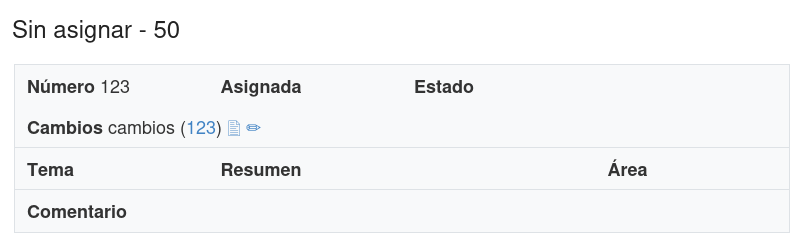

API
===

La API sirve para actualizar y consultar la base de datos de la
aplicación.  Está implementada en el módulo `api` como un `blueprint
<https://flask.palletsprojects.com/en/3.0.x/blueprints/>`_ de Flask.

Se accesa a partir de la ruta `/api` mediante un programa que opere
como un cliente de HTTP.  El acceso está restringido mediante una
llave.

LA API ofrece funciones que los usuarios de la aplicación no pueden
realizar, por ejemplo:

 - Agregar, modificar y remover iniciativas
 - Listar las iniciativas

Para llamar las funciones se necesitan:

 #. La URL del elemento a modificar o consultar
 #. El método para la función a realizar
 #. Los datos requeridos en formato JSON

El programa cliente debe hacer la solicitud HTTP a la URL con el
método indicado e incluir los datos en el cuerpo de la solicitud.

La respuesta de la aplicación es en formato JSON, de esta forma cuando
es exitosa::

   {
       "result": "ok: iniciativa 123 creada"
   }

Y así cuando hay un error::

   {
       "result": "error: iniciativa 123 no creada"
   }

Iniciativa
-----------

Ruta: /api/iniciativa

   +-----------+------------------------+----------------------------------+----------------------+
   |  Método   | Función                | Datos requeridos                 | Datos opcionales     |
   +===========+========================+==================================+======================+
   |  POST     | Agregar                | entidad, legislatura, numero,    | tema, resumen        |
   |           |                        | key,                             |                      |
   |           |                        | cambios, documento               |                      |
   +-----------+------------------------+----------------------------------+----------------------+
   |  PATCH    | Actualizar             | entidad, legislatura, numero,    | cambios, documento,  |
   |           |                        | key                              | estado_id            |
   |           |                        |                                  |                      |
   +-----------+------------------------+----------------------------------+----------------------+
   |  DELETE   | Remover                | entidad, legislatura, numero,    |                      |
   |           |                        | key                              |                      |
   |           |                        |                                  |                      |
   +-----------+------------------------+----------------------------------+----------------------+
   |  GET      | Listar                 | entidad, legislatura, key        |                      |
   +-----------+------------------------+----------------------------------+----------------------+

Los siguientes ejemplos se realizan con `HTTPie
<https://httpie.io/>`_, el servidor local de flask y la llave
predeterminada para pruebas, incluida en el archivo `defaults.py`.

Para crear una iniciativa::

  http POST https://localhost:5000/api/iniciativa \
       entidad=Jalisco legislatura=LXIII numero=123 \
       document=documento.pdf cambios="Cambios" \
       key='api-key-cambiar'

HTTPie muestra la respuesta de la aplicación, la cual incluye el
estado, los encabezados y el contenido en formato JSON de la respuesta
HTTP::

  HTTP/1.1 200 OK
  Cache-Control: no-store
  Connection: close
  Content-Length: 46
  Content-Type: application/json
  Date: Fri, 06 Sep 2024 20:59:16 GMT
  Referrer-Policy: no-referrer, strict-origin-when-cross-origin
  Server: Werkzeug/3.0.3 Python/3.12.4
  Server: NULL
  Strict-Transport-Security: max-age=63072000; includeSubdomains
  Vary: Cookie
  X-Content-Type-Options: nosniff
  X-Frame-Options: SAMEORIGIN
  X-XSS-Protection: 0

  {
      "result": "ok: iniciativa 123 creada"
  }

Si la llamada fue exitosa, los usuarios de la aplicación ya podrán ver
listada en el grupo *Sin asignar* esta iniciativa que se agregó:

Para remover esta iniciativa, si no está ya asignada a un usuario::

  http DELETE https://localhost:5000/api/iniciativa \
       entidad='Jalisco' legislatura='LXIII' numero=123 \
       key='api-key-cambiar'

Con el resultado::

  HTTP/1.1 200 OK
  Cache-Control: no-store
  Connection: close
  Content-Length: 52
  Content-Type: application/json
  Date: Fri, 06 Sep 2024 21:04:41 GMT
  Referrer-Policy: no-referrer, strict-origin-when-cross-origin
  Server: Werkzeug/3.0.3 Python/3.12.4
  Server: NULL
  Strict-Transport-Security: max-age=63072000; includeSubdomains
  Vary: Cookie
  X-Content-Type-Options: nosniff
  X-Frame-Options: SAMEORIGIN
  X-XSS-Protection: 0

  {
      "result": "ok: iniciativa 123 removida"
  }

Para listar todas las iniciativas existentes::

  http GET http://localhost:5000/api/iniciativa entidad='Jalisco' \
       legislatura='LXIII'  key='api-key-cambiar'

El resultado incluye una lista en la que cada elemento es un
diccionario con los valores de cada iniciativa::

  {
   "result": [
    {
      "cambios": "cambios",
      "comentario": "",
      "documento": "documento.pdf",
      "estado": null,
      "numero": 123,
      "resumen": "",
      "tema": "",
      "usuario": null
    },
    ...
    ]
  }
